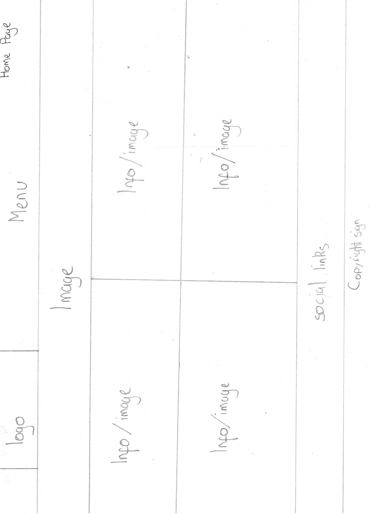
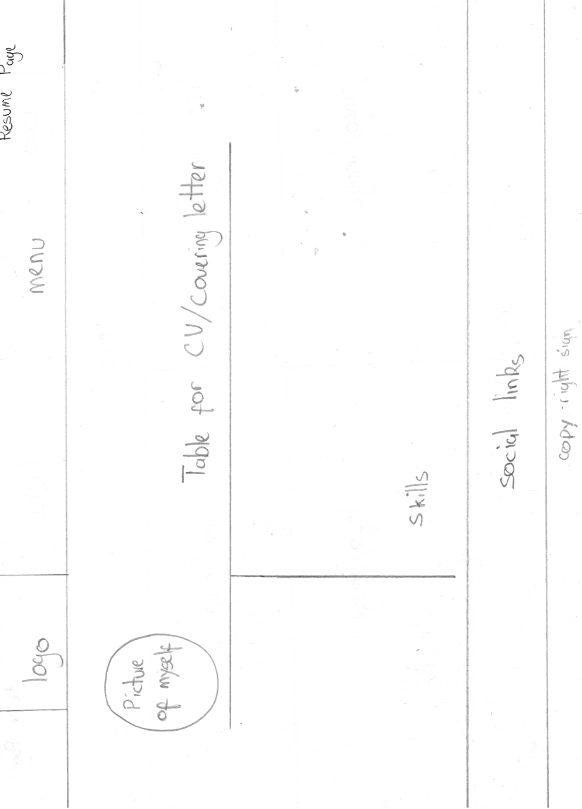
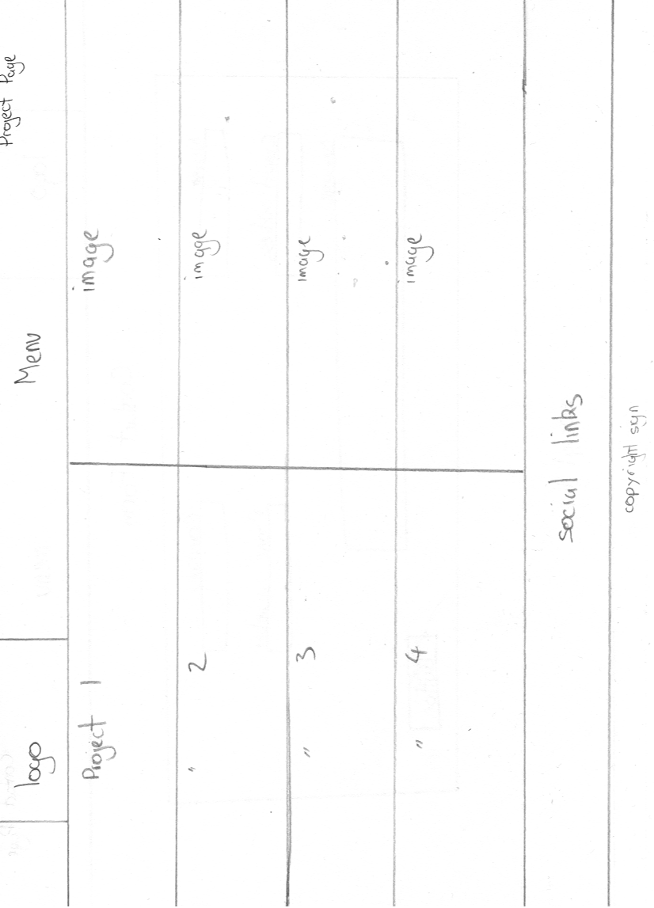
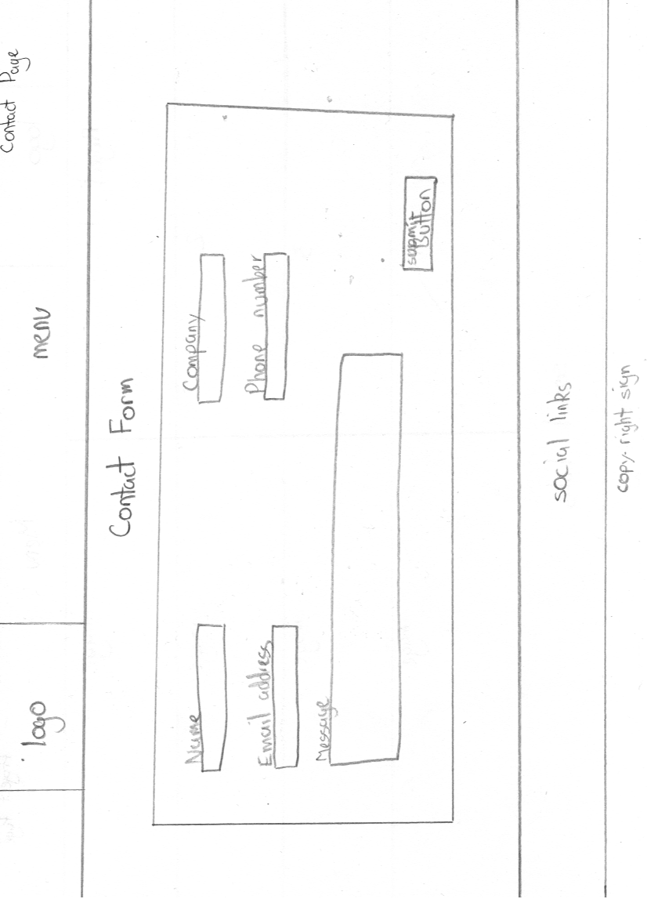
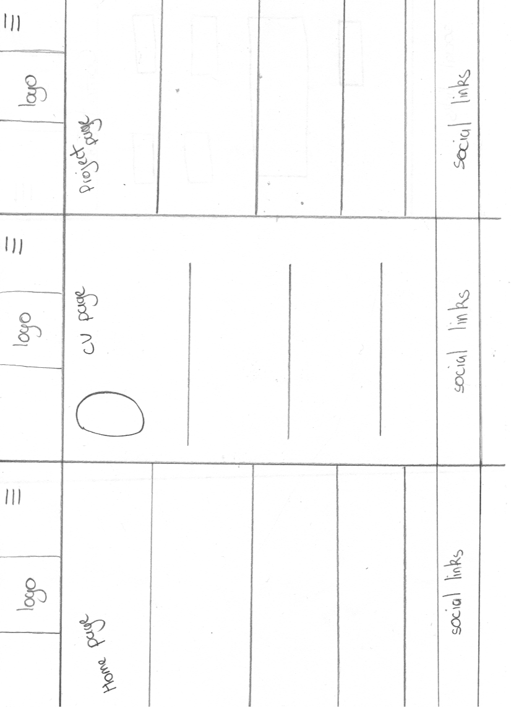
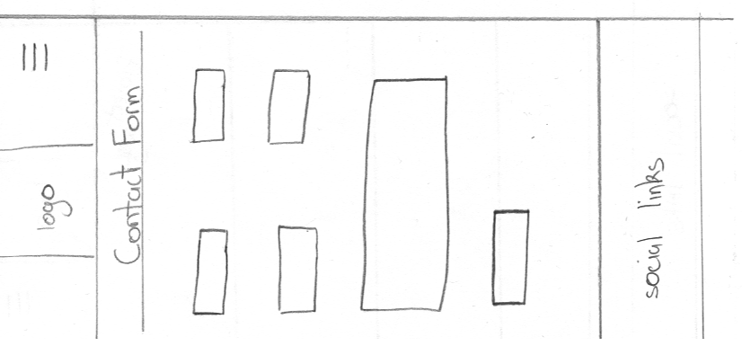

# Front End Web Development Practical Coursework

This website has been made for myself in order to show information about myself as well as projects to attract the attention of potential work for myself. For this site I used HTML5, CSS3.

## Designs

### Home page

### Resume page

### Project page

### Contact page

### Mobile designs

### Mobile designs 2

## Development

### Switching Pages

This is included in the resume.js file. The function is used to display the covering letter in place of the resume on the same page. This is done by a function being called when clicked on which checks to see if the page is open which would return true if the page was already open as the function inside the bracket would be equal to each other so the function will terminate. If the function is not equal to each other then the function will return false and the next function will carrying out which makes the covering letter page active. The page has also been set to fade and out.

## Quality and Performance

I used the site [Dareboost](https://www.dareboost.com/en/home)  in order to test the speed of the site and check its quality.  Any issues involving quality or loading time are detected.

## Testing

In order to test the website I sent it round 16 each had different computer skill levels, the users ages varied from 16-70+. All of the gave me useful feedback. They all found that the website was easy to navigate round due to the navigation bar at the top. Some mentioned that on the fact that it was good that text was provided to state what pictures were as there one some which a fewer were unfamiliar with like the server for example. This was done by using alt tags. One of my elder users commented on the fact that the writing as a little bit small this resulted in me increasing the written to make sure it was readable by everyone.

## Issues

I had one issue regarding the resizing of the page everything had fallen into its correct place which it was set to besides the icon in the menu bar, it fell beneath the menu. After a long review of the code I was able to find the solution to that problem which was to reduce the width size of the logo to make space for the icon menu to sit in place. So instead of viewing it as a problem it is now how the website should be.

## Built With

These are what I used during the development of this website.

[Atom](https://atom.io/) - Text editor

[Github](https://github.com/) - Version Control

[Chrome](https://www.google.com/chrome/browser/desktop/index.html) - Web Browser

## Versioning

I used Git for version control.

## Validation

### HTML Validator

[HTML5 Validator](https://atom.io/)
### CSS Validator
[CSS Validator](https://atom.io/)
### Javascript Validator
[Javascript Validator](https://atom.io/)

##Author

Ileri Onawoga

My Github is [ilerionawoga01](https://github.com/ilerionawoga01/CTEC3905Assignment2)
